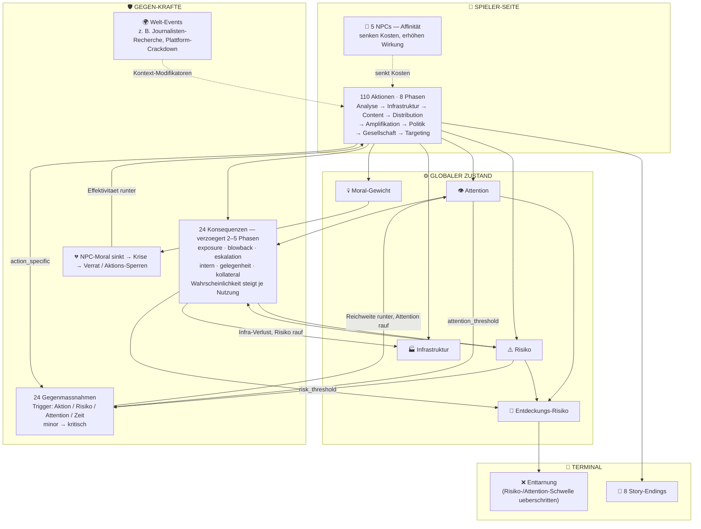

# 🗺️ Aktionen vs. Gegen-Aktionen — System-Übersicht (Story Mode)

> **Status:** Referenz (generiert aus den Spieldaten) · **Aktualisiert:** 2026-05-31 · **Scope:** Story Mode
> **Quelle:** `src/story-mode/data/{actions,actions_continued,countermeasures,consequences,npcs,world-events}.json`
> **Hinweis:** Dies bildet den **Story-Mode-Kampf (110 Aktionen)** ab. **Pro Mode** hat ein *separates*
> Netzwerk-/Trust-Modell (Akteure, Runden, Defensiv-Spawns) — bewusst **nicht** hier vermischt
> (siehe `VISION_LOCK_DRAFT.md` §5). Zahlen sind aus den Daten gezählt, nicht aus Prosa-Docs.

---

## Das System auf einen Blick

---

## Aktionen — 8 Phasen (110 gesamt)

| Phase | Fokus | Aktionen |
|---|---|---:|
| TA01 | Strategie & Analyse | 10 |
| TA02 | Infrastruktur & Assets | 20 |
| TA03 | Content-Erstellung | 19 |
| TA04 | Distribution | 15 |
| TA05 | Amplifikation | 12 |
| TA06 | Politik & Lobbying | 10 |
| TA07 | Gesellschaft & Kultur | 8 |
| Targeting | Einschüchterung / Rekrutierung | 16 |
| **Σ** | | **110** |

### 5 Kosten-Dimensionen (jede Aktion zahlt in mehreren)

| Dimension | Symbol | Bedeutung |
|---|---|---|
| `budget` | 💰 | direkte Ausgaben (€k) |
| `capacity` | ⚡ | Operative Bandbreite (regeneriert pro Phase) |
| `risk` | ⚠️ | kumulatives Entdeckungs-Risiko (passiv) |
| `attention` | 👁️ | öffentliche Aufmerksamkeit → **zieht Gegen-Kräfte an** |
| `moral_weight` | 💀 | belastet NPC-Moral & Endings |

---

## Gegen-Kräfte (was zurückschlägt)

### 24 Gegenmaßnahmen — `countermeasures.json`
Reaktiv, sofort. Vier Trigger-Arten, vier Schweregrade.

| Trigger-Typ | Anzahl | feuert wenn … |
|---|---:|---|
| `action_specific` | 10 | bestimmte Aktion gespielt (`triggers_on`-Liste) |
| `time_based` | 5 | nach X Phasen |
| `attention_threshold` | 4 | Attention über Schwelle |
| `risk_threshold` | 3 | Risiko über Schwelle |

Schwere: **minor → moderate → severe → kritisch**. Beispiel-Effekte: Reichweite −50 %, **Attention +2 (Backfire)**, Account-Sperre, Infrastruktur-Verlust; *kritisch* = Game-Over-Drohung.

### 24 Konsequenzen — `consequences.json`
**Verzögert (2–5 Phasen)** und **stochastisch** — die Wahrscheinlichkeit steigt mit jeder Wiederholung (`per_use_increase` + Risiko-/Attention-Multiplikatoren). Jede Konsequenz bietet dem Spieler eine **Wahl** (z. B. *rebuild / pivot / deny*).

| Typ | Anzahl | Wirkung |
|---|---:|---|
| `exposure` (Enttarnung) | 6 | Operation aufgeflogen |
| `blowback` (Rückschlag) | 6 | unbeabsichtigte Negativ-Effekte |
| `escalation` (Eskalation) | 6 | Gegner zieht nach |
| `internal` (Intern) | 3 | Team/NPC-Schaden (Moral, Burnout) |
| `opportunity` (Gelegenheit) | 2 | positives Überraschungs-Event |
| `collateral` (Kollateral) | 1 | unschuldige Opfer |

### Welt-Events — `world-events.json`
Kontextuelle Modifikatoren, die Strategie erzwingen (z. B. *Wahl angekündigt* schaltet Wahlbeeinflussung frei; *Journalisten-Recherche* erhöht Risiko; *Plattform-Crackdown* senkt Bot-Wirkung).

### NPC-Ebene — `npcs.json`
`moral_weight` senkt NPC-Moral → bei Moral < 30 **Krise** → ignoriert/schlecht gelöst → **Verrat oder Effektivitäts-Einbruch**. Umgekehrt: passende Affinität senkt Kosten (−10/−20/−30 %) und hebt Wirkung.

---

## Die Rückkopplungs-Schleifen (Story Mode)

1. **Attention/Risiko → Gegen-Kräfte → mehr Attention/Risiko.**
   Aktion hebt Attention & Risiko → Gegenmaßnahmen/Konsequenzen feuern → deren Effekte heben Attention/Risiko *weiter* (Backfire) → Spirale Richtung Enttarnung.
2. **Wiederholung → steigende Konsequenz-Wahrscheinlichkeit.**
   Dieselbe Aktion mehrfach → `per_use_increase` → Enttarnung wird wahrscheinlicher. (Bestraft Monotonie, belohnt Varianz.)
3. **Moral-Gewicht → NPC-Krise → weniger Optionen.**
   Dunkle Aktionen senken NPC-Moral → Krise/Verrat → Aktionen gesperrt / teurere Alternativen.
4. **Verzögerung → „blindes" Handeln.**
   Konsequenzen treffen 2–5 Phasen später → der Spieler entscheidet ohne sofortiges Feedback → Planungsdruck.

> **Pro Mode (separat):** Das Netzwerk-Modell hat *eigene* Schleifen — Diminishing Returns pro Fähigkeit,
> Awareness → Resilienz → Widerstand, Defensiv-Akteur-Spawns (Faktenchecker/Regulierer) alle 8 Runden.
> Diese gehören **nicht** zum Story-Mode-Diagramm oben.

---

## Was die Karte über die Komplexität verrät (ehrliche Beobachtungen)

- **`attention` ist vierfach gekoppelt:** Kosten-Output **+** Entdeckungs-Risiko **+** Gegenmaßnahmen-Trigger **+** Konsequenz-Trigger. Eine Stellschraube, vier Wirkungen → schwer zu balancieren, aber genau das macht „Heat" spürbar. *Wenn etwas am Balancing kippt, fängt man hier an.*
- **Ursache→Wirkung ist absichtlich schwer lesbar** (verzögert + stochastisch). Realistisch — aber der Spieler braucht **klares Telegrafieren** („Risiko steigt", „dies wird Folgen haben"), sonst fühlt es sich willkürlich an.
- **`moral_weight` ist die *einzige* Brücke** zwischen mechanischem und menschlichem Spiel (Aktion → NPC → Verrat). Sie ist fragil, weil mehrere Docs die NPCs falsch beschreiben (siehe `VISION_LOCK_DRAFT.md` §1) — diese Brücke zuerst absichern.
- **110 Aktionen teilen sich nur 24 + 24 Counter** (über `triggers_on`-Listen). Gut für Wartbarkeit; Risiko: Aktionen *ohne* zugewiesenen Counter fühlen sich **folgenlos** an. → Lücken-Audit: welche der 110 Aktionen haben **keinen** Eintrag in `triggers_on`/`triggered_by`?

---

*Diese Datei ist generiert/abgeleitet aus den Spieldaten und sollte bei Daten-Änderungen neu erzeugt werden.*
